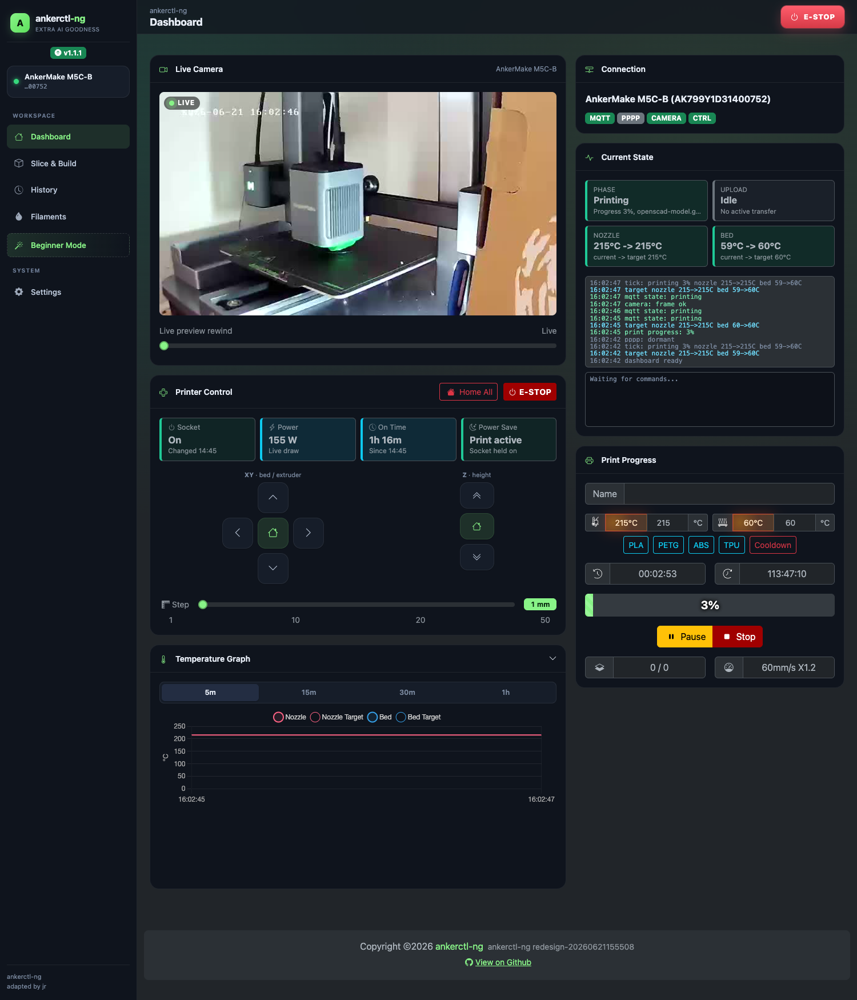
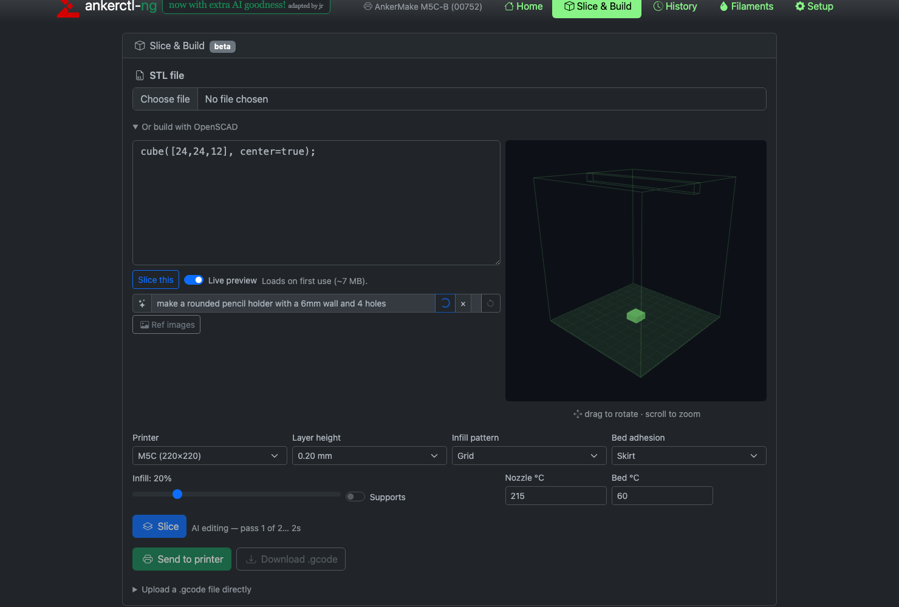
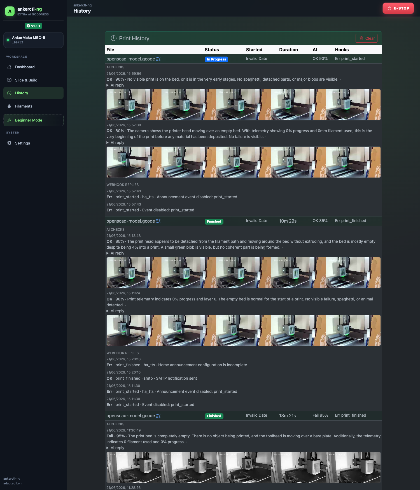
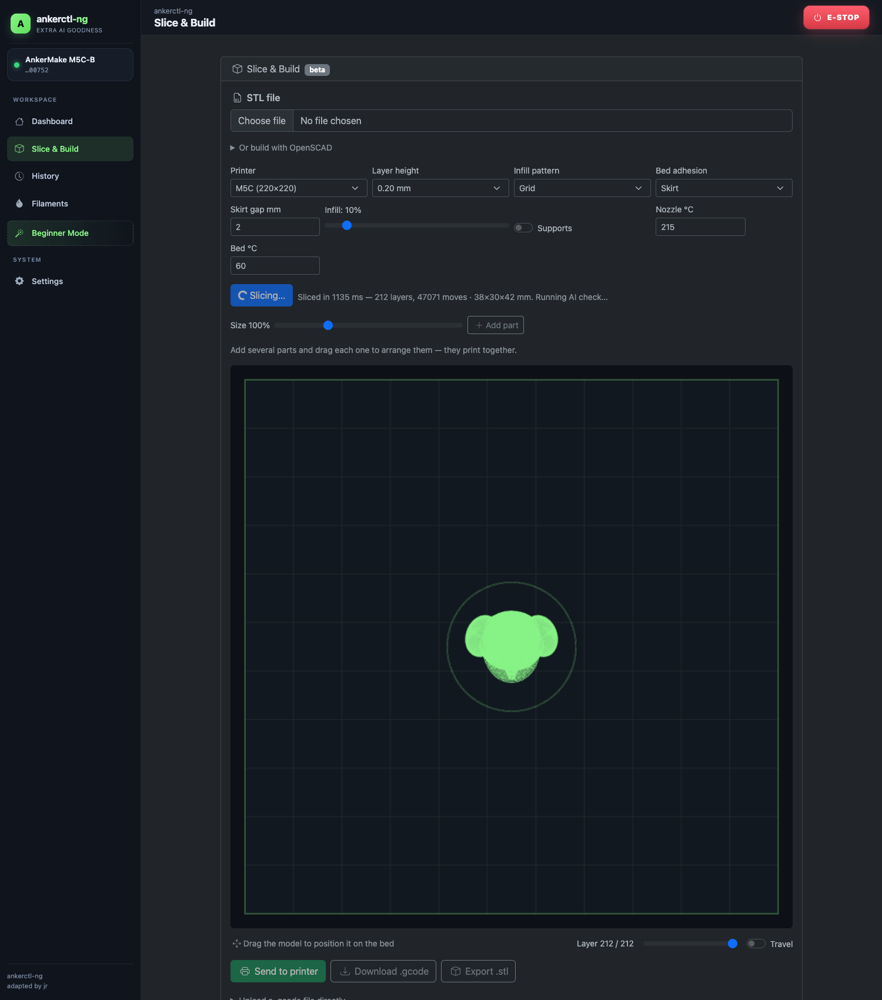
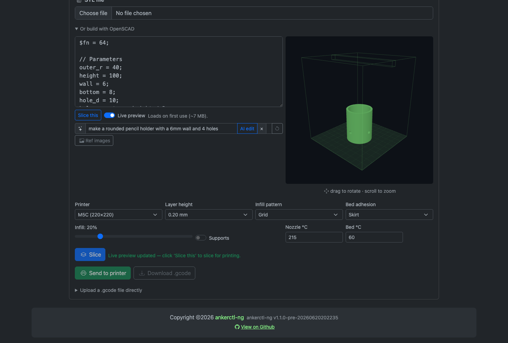
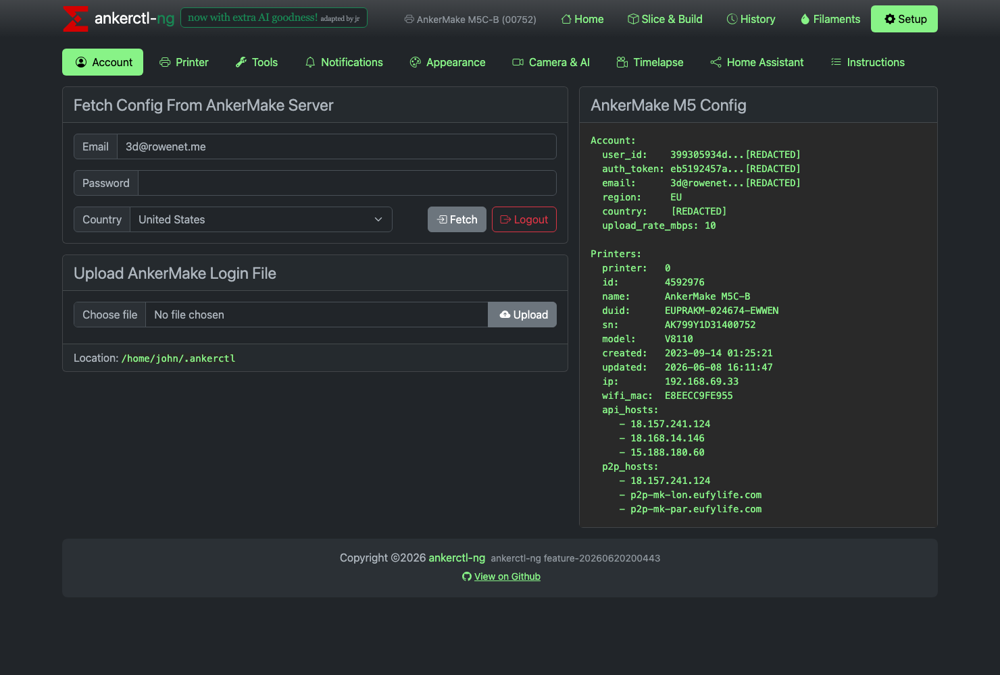

# ankerctl-ng

A substantially extended AnkerMake M5C web UI & CLI — in-browser slicing, AI-assisted OpenSCAD design, AI print monitoring with safety stops, Home Assistant integration, and more. *Now with extra AI goodness! (adapted by jr)*

> 🤖 Built with **DeepSeek V4 Pro** 🧠 + **GLM 5.2** ⚡ + a dash of **Claude Opus** 🎩 — and a *lot* of **jr551** direction 🧭

> **This is a fork.** `ankerctl-ng` builds on
> [`Django1982/ankerctl_go_remake`](https://github.com/Django1982/ankerctl_go_remake)
> (a Go re-implementation), which is itself a port of the original Python
> [`Ankermgmt/ankerctl`](https://github.com/Ankermgmt/ankerctl) project and its
> `libflagship` protocol library. All upstream work remains under the
> [GNU GPLv3](LICENSE). See [Credits & attribution](#credits--attribution).

[](https://github.com/jr551/ankerctl-ng/releases/tag/v1.1.0)
[](https://go.dev/)
[](LICENSE)
[](https://github.com/jr551/ankerctl-ng/actions/workflows/ci.yml)
[](https://ghcr.io/jr551/ankerctl-ng)



## ✨ What this fork adds

- 🧠 **AI print-failure monitoring** — periodic vision-model checks with saved replies and short-lived evidence images
- 🐾 **AI safety stop** — cuts printer power via the smart socket the instant a real, live non-human animal (a curious pet!) is spotted in frame
- 🧩 **Slice & Build** — in-browser slicing ([polyslice](https://github.com/jgphilpott/polyslice)) of STL **and** OpenSCAD, with AI-assisted OpenSCAD editing, a live 3D preview, and a post-slice AI sanity check — all off the main thread so the UI never freezes
- 🛑 **One-tap E-STOP** on the dashboard that cuts printer power immediately
- 🎨 **Filament colour match** — detect the loaded filament colour from the camera and match it to your library
- 📡 **PPPP upload hardening / self-healing** — keepalives, health checks, channel-close abort, and power-cycle recovery
- 🔌 **Smart-socket power-cycle recovery** for stuck uploads
- 🏠 **Home Assistant** camera support and smart-socket controls
- 🔔 **Notifications** via SMTP, raw webhook, and Apprise; notification history; HA speech hooks
- 🎞️ **Timelapse / camera capture**
- ⚡ **Power-saving controls**, better camera loading, and a modernized dashboard
- 🖨️ **OrcaSlicer-first** setup flow

## 🤖 AI in action — design a part from a sentence

Describe a part in plain English and the model writes the OpenSCAD, renders a live 3D preview, then **reviews its own result and refines it** for up to 5 passes — with live, per-pass status so it never looks stuck:



## 📸 Highlights

| | |
|---|---|
| **🧾 Print history with AI evidence frames**<br> | **🧩 Slice & Build — STL or OpenSCAD in the browser**<br> |
| **✏️ AI-refined OpenSCAD result**<br> | **🧠 AI print monitoring + 🐾 animal safety stop**<br> |

> *Screenshots from a live AnkerMake M5C running ankerctl-ng.*

## Status

This is an **experimental build**. It is aimed at people who want the extra features above and are comfortable with a moving target.

## Quick start

### Source install

```sh
git clone https://github.com/jr551/ankerctl-ng.git
cd ankerctl-ng
./install.sh install
```

The script:

- installs Go build tools if missing
- builds `ankerctl-ng`
- installs it
- asks whether to create a `systemd` service

To update later:

```sh
git pull
./install.sh update
```

### Docker

```sh
docker run -d \
  --name ankerctl-ng \
  --network host \
  -v ~/.ankerctl-ng:/home/ankerctl/.ankerctl-ng \
  -v ankerctl-ng-captures:/captures \
  ghcr.io/jr551/ankerctl-ng:latest
```

Or:

**Docker Compose:**

```yaml
services:
  ankerctl-ng:
    image: ghcr.io/jr551/ankerctl-ng:latest
    container_name: ankerctl-ng
    network_mode: host
    restart: unless-stopped
    volumes:
      - ~/.ankerctl-ng:/home/ankerctl/.ankerctl-ng
      - ankerctl-ng-captures:/captures
    env_file: .env

volumes:
  ankerctl-ng-captures:
```

Copy `.env.example` to `.env` and adjust the values, then run:

```sh
docker compose up -d
```

`network_mode: host` is still required for printer LAN traffic.

> **Firewall:** If ufw or another stateful firewall is enabled on the host, allow inbound UDP on **32100, 32108, and 32109**. ankerctl binds these as fixed local ports so conntrack can pass the printer's reply to a broadcast LanSearch. See [`docs/operations/firewall.md`](docs/operations/firewall.md) for the full rationale and `ufw allow` commands.

To build locally instead:

```sh
docker build -t ankerctl-ng .
```

## OrcaSlicer

Use OrcaSlicer with:

- Host type: `OctoPrint`
- Host / URL: `http://YOUR-HOST:4470`
- API key: only if you enabled write protection

Use `Send and Print` when you want the job to start immediately.

## Notes

- Default UI port: `4470`
- Config dir for new installs: `~/.ankerctl-ng`
- Older `~/.ankerctl` installs are still detected automatically

## Repo docs

Most of the older migration and protocol docs are still in [`docs/`](docs/), but the simplest path is:

1. use `install.sh`
2. open the web UI
3. import/login
4. connect OrcaSlicer

## Building manually

If you prefer to build the binary yourself instead of `install.sh`:

```sh
bash scripts/prepare-web-vendor.sh   # fetch vendored web assets
go build -o ankerctl-ng ./cmd/ankerctl/
go test ./...                        # optional: run the test suite
```

## Credits & attribution

`ankerctl-ng` is a community fork and would not exist without the work it descends from:

- **Original project:** [`Ankermgmt/ankerctl`](https://github.com/Ankermgmt/ankerctl)
  (the Python `ankerctl` / `ankermake-m5-protocol` project) — the `libflagship`
  library that reverse-engineered the AnkerMake M5 MQTT, PPPP, and HTTP/Cloud
  APIs, and the first web UI/CLI that everything here is built on.
- **Go re-implementation (direct upstream):**
  [`Django1982/ankerctl_go_remake`](https://github.com/Django1982/ankerctl_go_remake) —
  a 1:1 Go port of the Python original (see [`docs/MIGRATION_PLAN.md`](docs/MIGRATION_PLAN.md)).
  This fork is based on it, and keeps the Go module path
  `github.com/django1982/ankerctl` to preserve import compatibility.
- **This fork (`ankerctl-ng`, by jr):** adds AI print-failure monitoring, PPPP
  upload hardening / self-healing, smart-socket power-cycle recovery, Home
  Assistant integration, expanded notifications, and UI changes.

Many thanks to the upstream authors and the AnkerMake protocol community.
See [`NOTICE`](NOTICE) for the full attribution chain and
[`CONTRIBUTING.md`](CONTRIBUTING.md) to get involved.

## License

This project and all of its upstreams are licensed under the
**[GNU General Public License v3.0](LICENSE)**. As a derivative work, this fork
stays under the same license, with source available and the upstream
copyright/license text in [`LICENSE`](LICENSE) preserved unchanged.
