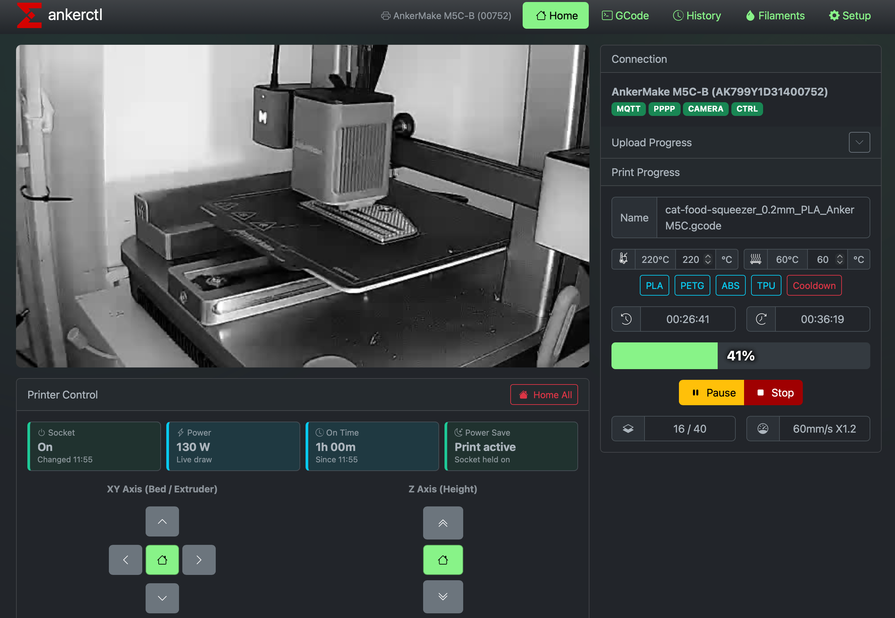

# ankerctl-ng

Experimental AnkerMake web UI and CLI build.



## What this fork adds

- Home Assistant camera support and smart socket controls
- AI print checks with saved replies and short-lived evidence images
- Notification history, raw webhook posting, SMTP helper, and HA speech hooks
- Power saving controls, better camera loading, and UI cleanup for day-to-day printer use
- OrcaSlicer-first setup flow

## Status

This is an **experimental build**. It is aimed at people who want the extra features above and are comfortable with a moving target.

## Quick start

### Source install

```sh
git clone https://github.com/jr551/ankerctl_go_remake.git
cd ankerctl_go_remake
./install.sh install
```

The script:

- installs Go build tools if missing
- builds `ankerctl-ng`
- installs it
- asks whether to create a `systemd` service

To update later:

```sh
git pull
./install.sh update
```

### Docker

```sh
docker run -d \
  --name ankerctl-ng \
  --network host \
  -v ~/.ankerctl-ng:/home/ankerctl/.ankerctl-ng \
  -v ankerctl-ng-captures:/captures \
  ghcr.io/jr551/ankerctl-ng:latest
```

Or:

```sh
docker compose up -d
```

`network_mode: host` is still required for printer LAN traffic.

To build locally instead:

```sh
docker build -t ankerctl-ng .
```

## OrcaSlicer

Use OrcaSlicer with:

- Host type: `OctoPrint`
- Host / URL: `http://YOUR-HOST:4470`
- API key: only if you enabled write protection

Use `Send and Print` when you want the job to start immediately.

## Notes

- Default UI port: `4470`
- Config dir for new installs: `~/.ankerctl-ng`
- Older `~/.ankerctl` installs are still detected automatically

## Repo docs

Most of the older migration and protocol docs are still in [`docs/`](docs/), but the simplest path is:

1. use `install.sh`
2. open the web UI
3. import/login
4. connect OrcaSlicer
